# 03 · 整体方案设计

## 产品架构

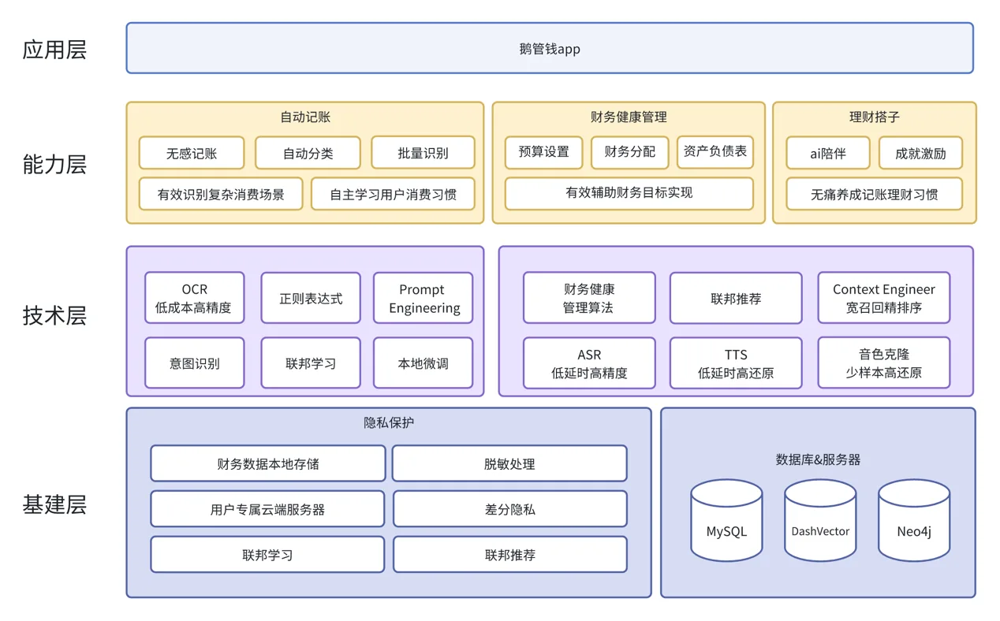

架构分为三层：

- **场景层**：自动记账 / 财务健康管理 / 理财搭子
- **能力层**：有效识别复杂消费场景、自主学习用户消费习惯、有效辅助财务目标实现、无痛养成记账理财习惯
- **技术层**：OCR、Prompt Engineering、Context Keeper、ASR/TTS、隐私保护、DashVector 向量检索等

## 三大产品支柱

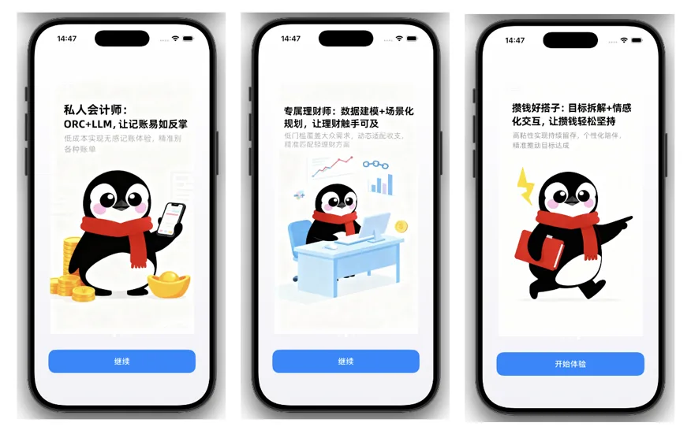

- **私人会计师**：OCR+LLM，让记账易如反掌
- **专属理财师**：数据建模+场景化规划，让理财触手可及
- **陪伴搭子**：目标拆解+情感化交互，让攒钱轻松坚持

## 核心功能与交互

### 使用前

#### App 欢迎界面与用户信息收集

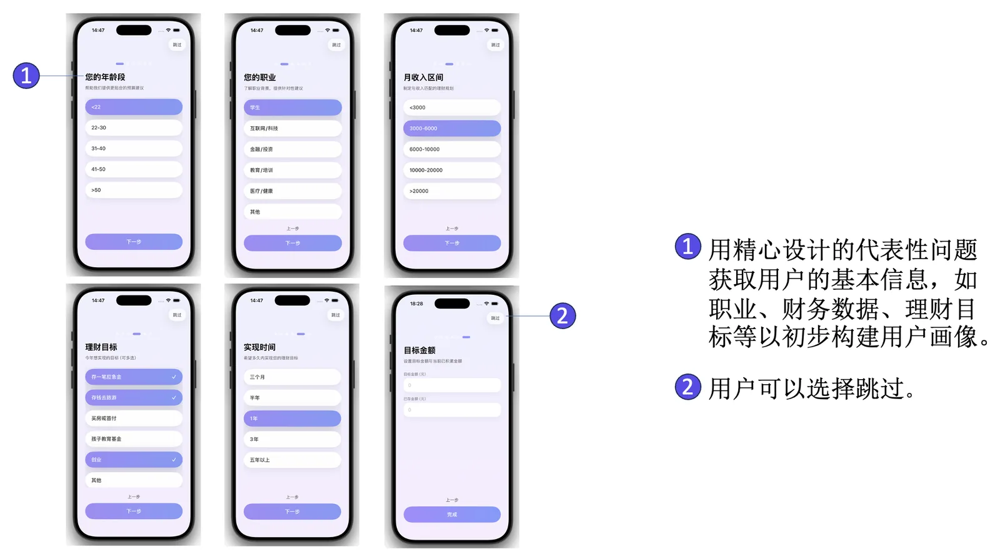

用精心设计的代表性问题获取用户的基本信息：职业、财务数据、理财目标等，以初步构建用户画像；用户可以选择跳过。

### 使用中

#### 首页 Dashboard

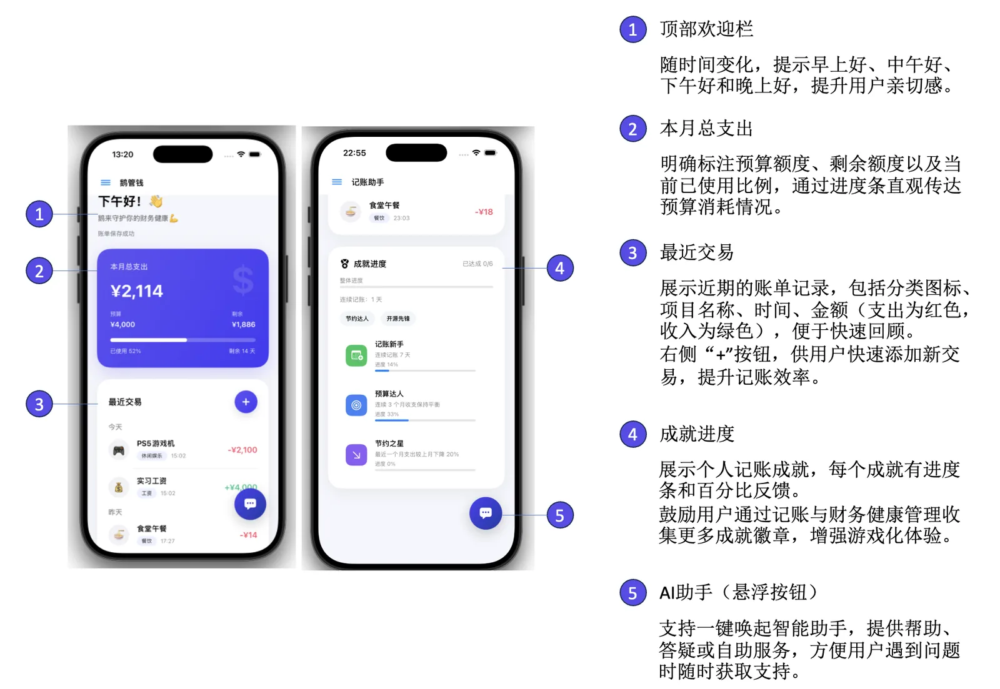

- **个性化欢迎栏**：随时间变化提示早上好/中午好/下午好/晚上好，提升亲切感
- **本月总支出**：明确标注预算额度、剩余额度以及当前已使用比例，通过进度条直观传达预算消耗
- **成就进度**：展示当前成就完成进度
- **最近交易**：展示近期账单记录，包括分类图标、项目名称、时间、金额

#### 添加交易

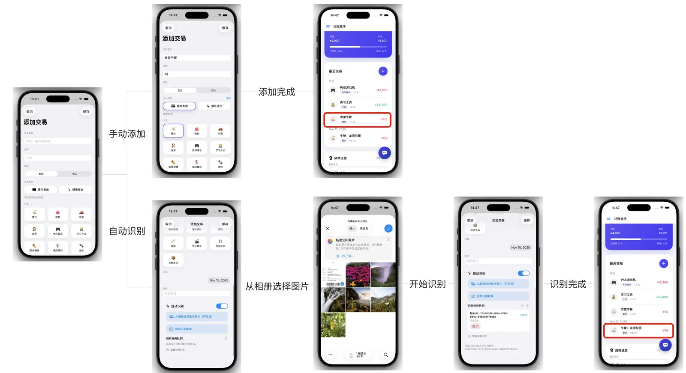

支持手动添加与 AI 识图两种入口；填写完成后即时生成结构化交易记录。

#### 统计分析

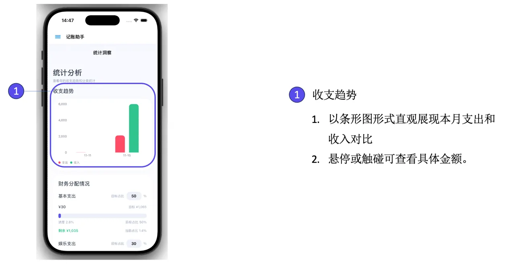

以条形图形式直观展现本月支出和收入对比，悬停或触碰可查看具体金额。

#### 财务健康管理

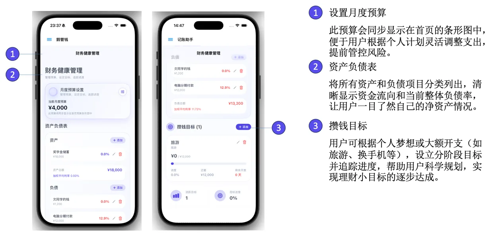

- **设置月度预算**：预算同步显示在首页条形图中，便于灵活调整支出、提前管控风险
- **资产负债表**：所有资产和负债项目分类列出，清晰显示资金流向和当前整体负债率

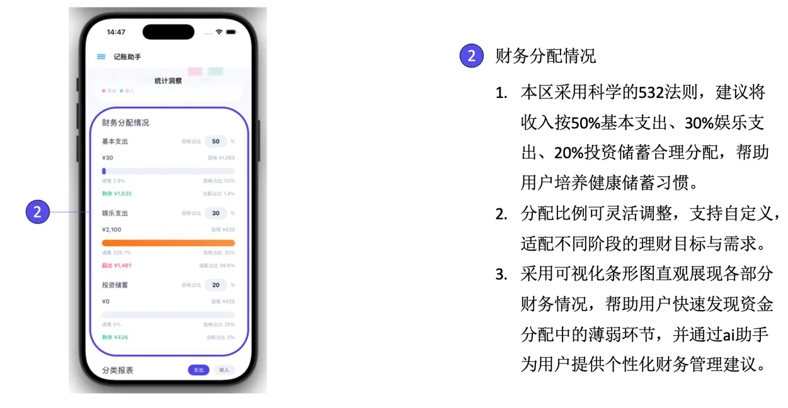

采用 **532 法则**：建议将收入按 50% 基本支出、30% 娱乐支出、20% 投资储蓄合理分配；分配比例可灵活调整、支持自定义。

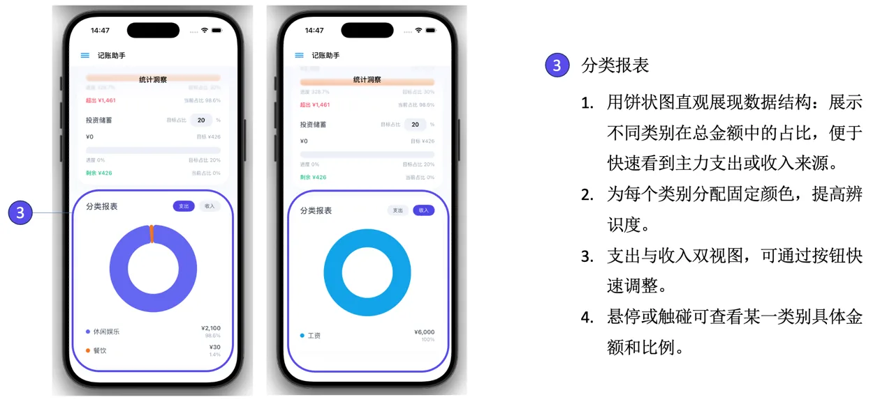

用饼状图直观展现数据结构，为每个类别分配固定颜色提高识别度；支出与收入双视图可快速切换。

#### AI 理财助手

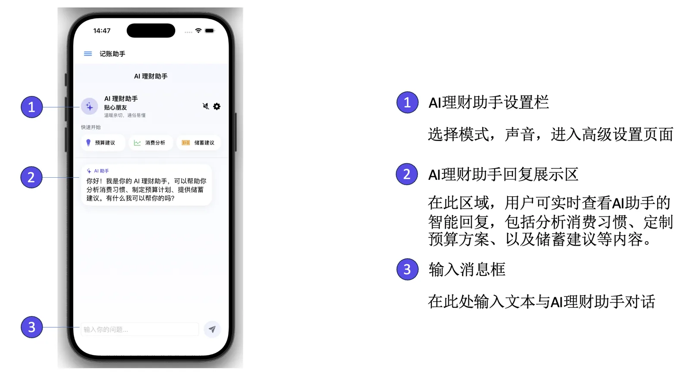

在记账场景内随时唤起聊天窗口，进行情绪陪伴、财务问答、数据解读、财务规划。

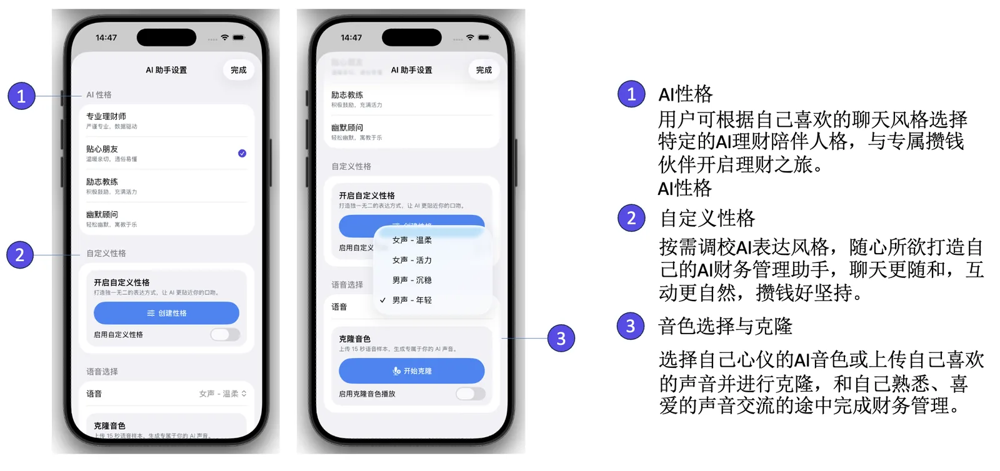

用户可根据自己喜欢的聊天风格选择伙伴开启理财之旅，也支持自定义性格，按需调校 AI 表达风格。

#### 成就徽章

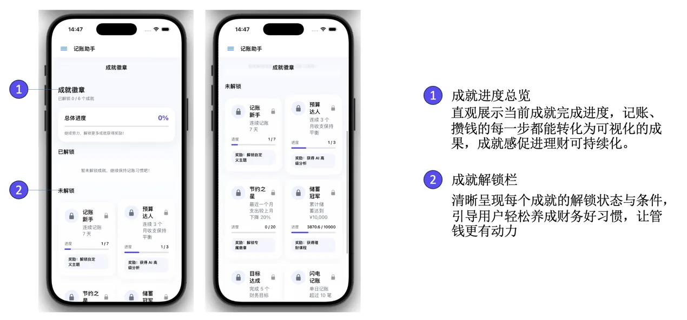

直观展示当前成就完成进度——记账、攒钱的每一步都能转化为可视化的成果，成就感促进理财可持续化；清晰呈现每个成就的解锁状态与条件。
