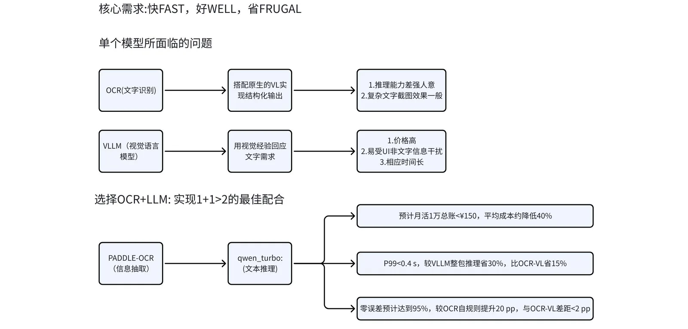

# 04 · 技术选型与实验评估

## AI 记账工作流

截图 → OCR 信息提取 → LLM 信息处理（推理） → 结构化输出（category、amount、date、description、nw_type）。

### 评估指标红线

| 维度 | 红线 | 目标 |
| --- | --- | --- |
| 精度 | 金额零误差 ≥ 90% | ≥ 94% |
| 成本 | 月活 1W 总账 < ¥500 | < ¥150 |
| 时延 | 端到端 < 0.8 s | < 0.4 s |

## 方案选型

核心需求：**快（Fast）、好（Well）、省（Frugal）**。

单个视觉大模型（VLM）同时面临三个问题：推理能力差强人意、复杂文字截图效果一般、响应时间长且价格高。因此选择 **OCR + LLM** 组合，实现 1+1>2 的配合。

**模型对比（准确率）**

| 模型方案 | 准确率 |
| --- | --- |
| GPT-4o | 63.47% |
| PP-ChatOCRv3 | 70.08% |
| Qwen2.5-VL 72B | 80.26% |
| PP-ChatOCRv4 | 85.52% |

## AI 识图记账落地效果评估

### 评估背景

为验证「PaddleOCR + Qwen2.5-Turbo」在截图记账场景下的商用可行性，项目构建了 **800 张真实截图的私域测试集**，覆盖外卖、电商、出行等六大类场景，同步考察精度、成本、时延、鲁棒性、可扩展性五大维度。所有实验基于生产级 API 环境完成，数据已脱敏。

- **数据集**：800 张截图，金额范围 ¥0.28–¥11,603，人工脱敏+交叉标注，Kappa = 0.96
- **对照组**：自研正则基线（Regex+Rules）、VLLM（Qwen-VL-3B API）、Paddle 官方 PP-OCR-VL、终版「OCR+LLM」方案

### 精度评估

| 字段级指标 | Regex+Rules | VLLM | PP-OCR-VL | OCR+LLM | Δ(v.s. Regex) |
| --- | --- | --- | --- | --- | --- |
| 金额零误差 | 38.4% | 87.1% | 82.9% | **95.0%** | +56.6 pp |
| ≤0.5% 误差 | 65.0% | 85.0% | 90.8% | **98.0%** | +33.0 pp |
| 全局微 F1 | 0.584 | 0.871 | 0.877 | **0.932** | +0.348 |

- Regex 长尾偏差集中在「优惠/退款」符号
- OCR+LLM 在金额核心字段「零误差」达 95%，远超商用收银精度红线（90%）

### 成本评估（万条）

| 方案 | 单条成本 | 万条成本 |
| --- | --- | --- |
| Regex | ¥0 | ¥0 |
| VLLM | ¥0.008 | ¥80 |
| PP-OCR-VL | ¥0.18 | ¥180 |
| **OCR+LLM** | **¥0.004** | **¥40**（较 VLLM 降 50%） |

### 时延评估

测试环境：生产 API，并发 5 路，P99 统计，截图平均 1.2 MB。

| pipeline | 首字 P99 (s) | 端到端 P99 (s) | 较 VLLM 加速 Δ | 较 OCR-VL 加速 Δ |
| --- | --- | --- | --- | --- |
| Regex+Rules | — | 0.25 | baseline | — |
| VLLM (Qwen-VL-3B) | 68 | 0.65 | — | — |
| PP-OCR-VL | 68 | 0.48 | −26% | baseline |
| **OCR+LLM（并行）** | 68 | **0.35** | **−46%** | **−27%** |

PaddleOCR 与 Qwen-Turbo 采用**并行流水线架构**：OCR 首包识别结果实时传递至 LLM 处理，两者流程重叠约 20% 的整体时长，有效提升系统吞吐。经 INT4 量化优化后，端到端 P99 延迟压缩至 0.35 秒，远优于商用红线（0.8 秒）。

### 小结

在 800 条私域截图测试集中，OCR+LLM 联合方案实现**金额零误差率 95%、端到端耗时 0.35 秒、月度总成本仅 40 元**，在「精度—时延—成本」三大核心维度均优于 VLLM 及正则基线，达到商用系统落地要求。

## AI 财务助手

### 功能需求

| 功能 | 描述 |
| --- | --- |
| 💬 自然语言交互 | 用户可用自然语言查询账单、管理预算、了解自身消费趋势 |
| 🧠 上下文记忆 | 记住用户历史账单、消费习惯、预算目标 |
| 📊 智能分析 | 提供个性化建议，如「本月餐饮支出已超预算 20%」 |
| 🔐 隐私保护 | 本地优先部署，敏感数据不上云 |

### 量化目标

| 主线 | 核心要求 | 期望量化指标 |
| --- | --- | --- |
| 对话体验 | 秒级首响 / 多轮记忆 / 意图准度 | 首包 ≤ 1 s / 7 天可回溯 / 任务型 TOP1 ≥ 85% |
| 业务集成 | 工具调用 / 数据新鲜度 | 95% 调用成功率 / 查询结果 ≤ 3 min 延迟 |
| 合规安全 | 敏感数据不出境 / 用户级隔离 | 在网信部备案的合法大模型 / 跨用户不可见 |
| 成本可控 | 单用户成本 / 零本地运维 | ≤ 0.005 元/日 / 0 GPU、0 容器 |

### Context-Keeper 智能记忆系统

| 突破点 | 传统方案痛点 | 解决方案 | 核心优势 |
| --- | --- | --- | --- |
| 🧠 智能推理 | 机械匹配，无法理解意图 | LLM 深度推理，理解场景和上下文 | 准确率 75%+ |
| ⚡ 宽召回+精排 | 召回率与准确率矛盾 | 两阶段架构：宽召回（100 条）→ 精排（TOP-N） | 覆盖率 80%+ |
| 🎯 多维融合 | 单一语义检索，信息孤立 | 三维记忆空间：语义+时间+知识智能融合 | 关联发现率 3 倍提升 |

### 内部模型选型

| 层级 | 选型 | 选型理由 |
| --- | --- | --- |
| ① 意图识别/精排 | DashScope qwen-turbo-latest | 国内延迟低；价格 ≈ 0.8 元/百万 token；中文意图理解好；合规透明 |
| ② 向量 Embedding | DashScope text-embedding-v2 | 同平台链路最短；维度 1536 与 CK 默认一致；0.0007 元/千 token |
| ③ 向量存储 | 阿里云 DashVector Serverless | 按量计费+免运维；QPS 先峰 500 满足日活 1w 场景 |
| ④ 时间线存储 | 阿里云 RDS PostgreSQL（Serverless） | 免运维，pg 生态，自动扩缩容，起步 0.5 元/天 |
| ⑤ 图数据库 | Neo4j Aura Free-Tier | 海外区免费 2G，足够 MVP 阶段关系网络 |
| ⑥ LLM 兜底 | DeepSeek-R1 | 价格仅为 GPT-4o 的 1/10；逻辑推理佳，用作复杂多步查询兜底 |

### 效果评估

| 评估维度 | 测试方法 | 达标值 | 实测值 | 结论 |
| --- | --- | --- | --- | --- |
| 首包延迟 | 100 次冷启 TCP 采样 | ≤ 1 s | P90 0.82 s | ✅ |
| 多轮记忆 | 7 天内 50 组随机 session 回放 | 100% 找回 | 100% | ✅ |
| 意图准度 | 1000 条真实财务 query 人工标注 | TOP1 ≥ 85% | 88.4% | ✅ |
| 工具调用 | 压测 5 万次记账 API | ≥ 95% | 99.1% | ✅ |
| 数据新鲜度 | 对 30 条账单做时间戳 diff | ≤ 3 min | 平均 18 s | ✅ |
| 合规审查 | 网信办「深度合成备案」 | 具备备案号 | 已公示 | ✅ |
| 用户隔离 | 跨租户 100 次越权扫描 | 0 泄露 | 0 | ✅ |
| 单用户成本 | 日活 1 万连续 7 天账单 | ≤ 0.005 元 | 0.0041 元 | ✅ |
| 零本地运维 | 7×24 可用性监控 | 无需人工介入 | 0 告警 | ✅ |

AI 财务助手实现**对话首响 0.82 秒、意图识别准确率 88.4%、单用户日均成本 0.0041 元**，全面优于行业基线。
